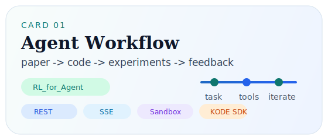
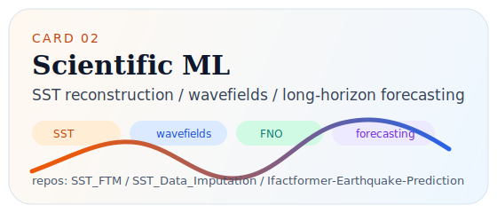
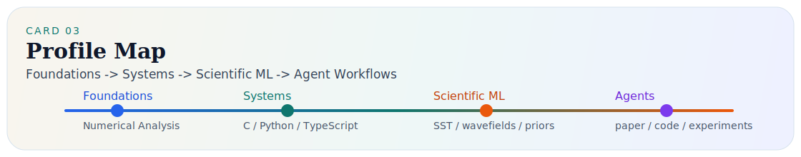

  

<h1 align="center">lkun</h1>

  <strong>Numerical Analysis · Systems Engineering · Scientific ML · Agent Workflows</strong>

  I work across numerical methods, practical software systems, scientific machine learning, and AI agent workflows.
   
  我希望把扎实的数值分析基础、可落地的工程实现、面向物理问题的建模，以及能读论文、改代码、跑实验的 Agent 系统连接成一条完整链路。

  
  
  
  
  
  

---

## About Me / 关于我

I am interested in building end-to-end research systems rather than isolated demos.

对我来说，一个好的项目不只是“模型能跑”，还要同时回答这些问题：  
它是否有清晰的问题背景、是否有合理的方法结构、是否真的能实现和复现、以及它能不能支撑下一轮迭代。

This profile is therefore not only about one direction.  
It reflects a path that moves from `numerical analysis foundations`, to `systems implementation`, to `scientific ML for physical / spatiotemporal problems`, and further to `agentic workflows for research and code generation`.

---

## Profile Map / 能力地图

<table>
  <tr>
    <td width="25%" valign="top">
      <h3>Foundations</h3>
      
Numerical analysis, approximation, optimization intuition, and scientific computing basics.

      
<code>interpolation</code> <code>integration</code> <code>ODE</code> <code>SVD</code> <code>eigenvalue methods</code>

    </td>
    <td width="25%" valign="top">
      <h3>Systems</h3>
      
Practical software implementation with C / Python / TypeScript, including state handling, interfaces, data flow, and maintainable project structure.

      
<code>backend service</code> <code>CLI / tooling</code> <code>data structures</code> <code>workflow design</code>

    </td>
    <td width="25%" valign="top">
      <h3>Scientific ML</h3>
      
Modeling for SST reconstruction, wavefield prediction, and long-horizon forecasting with operator learning and domain priors.

      
<code>SST imputation</code> <code>wavefields</code> <code>FNO</code> <code>FTM</code> <code>forecasting</code>

    </td>
    <td width="25%" valign="top">
      <h3>Agents</h3>
      
Agent loops that can read context, use tools, modify code, run experiments, and iterate on the result.

      
<code>tool use</code> <code>code editing</code> <code>sandbox</code> <code>paper-to-code</code> <code>iteration</code>

    </td>
  </tr>
</table>

---

## Repository Map / 仓库地图

| Track | Repository | What it represents |
| --- | --- | --- |
| Foundations | [The-homework-of-Numerical-Analysis](https://github.com/lkun45598-lgtm/The-homework-of-Numerical-Analysis) | My numerical analysis foundation: interpolation, integration, ODEs, SVD, eigenvalue methods, and the mathematical side of AI + PDE work. |
| Systems Practice | [High-Speed-Rail-Ticket-Booking-Management-System.](https://github.com/lkun45598-lgtm/High-Speed-Rail-Ticket-Booking-Management-System.) | A C language project focused on linked lists, authentication, persistence, order management, and practical logic design. |
| Systems + ML Application | [PUBG-Weapon-Sound-Recognition-and-Inventory-System.](https://github.com/lkun45598-lgtm/PUBG-Weapon-Sound-Recognition-and-Inventory-System.) | A more complete application-style project that combines GUI, account / inventory logic, audio processing, model training, and result visualization. |
| Scientific ML | [SST_Data_Imputation](https://github.com/lkun45598-lgtm/SST_Data_Imputation) / [SST_Data_Imputation_2.0](https://github.com/lkun45598-lgtm/SST_Data_Imputation_2.0) / [SST_FTM](https://github.com/lkun45598-lgtm/SST_FTM) | An evolving line of work on SST reconstruction, moving from imputation experiments toward more structured hybrid modeling with priors, FNO, and attention. |
| Scientific ML | [Ifactformer-Earthquake-Prediction](https://github.com/lkun45598-lgtm/Ifactformer-Earthquake-Prediction) | Long-horizon seismic wavefield prediction with staged training, autoregressive rollout, and attention to stability over multiple forecast steps. |
| Agent Workflow | [RL_for_Agent](https://github.com/lkun45598-lgtm/RL_for_Agent) | A KODE SDK based AI agent service that exposes REST / SSE APIs, sandboxed tools, and a paper-to-code loss transfer workflow. |

---

## What Connects These Projects / 这些项目是怎么连起来的

1. `Numerical foundations` gave me the language to think about approximation, stability, optimization, and PDE-related problems instead of treating models as black boxes.
2. `Systems projects` trained me to care about data structures, interfaces, permissions, persistence, and whether an idea can actually become a working piece of software.
3. `Scientific ML projects` pushed that foundation into real physical and spatiotemporal tasks such as SST reconstruction and seismic wavefield forecasting, where structure and priors matter.
4. `Agent projects` are where I try to close the loop: read a paper, understand a task, modify code, run experiments, inspect outputs, and improve the next attempt.

In short, this profile is not only about one model family or one benchmark.  
It is about building a bridge from mathematical foundations and engineering practice to reproducible research systems.

---

## Current Interests / 当前重点

- Building more reliable agent workflows for code editing and experiment execution
- Turning paper understanding into executable implementation plans
- Learning from trajectories and distilled experience for agent improvement
- Combining domain priors and neural operators for long-horizon forecasting
- Making research code easier to verify, reproduce, and iterate on

---

## Working Style / 工程偏好

- I prefer projects with a clear problem statement, explicit structure, and a reproducible training or evaluation path.
- I like systems that are modular enough to evolve: data preparation, modeling, inference, visualization, and deployment should not be mixed into one opaque script.
- I value implementation details, because many research ideas only become convincing after they survive configuration, debugging, and repeated experiments.

---

## Toolbox / 常用技术

  
  
  
  
  
  
  
  

---

## GitHub Overview

<table>
  <tr>
    <td width="50%" align="center" valign="top">
      
    </td>
    <td width="50%" align="center" valign="top">
      
    </td>
  </tr>
  <tr>
    <td colspan="2" align="center" valign="top">
      
    </td>
  </tr>
</table>

---

## Contact

- GitHub: [lkun45598-lgtm](https://github.com/lkun45598-lgtm)
- Profile repository: [lkun45598-lgtm/lkun45598-lgtm](https://github.com/lkun45598-lgtm/lkun45598-lgtm)
