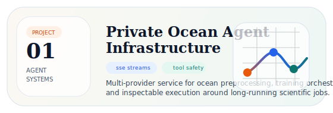
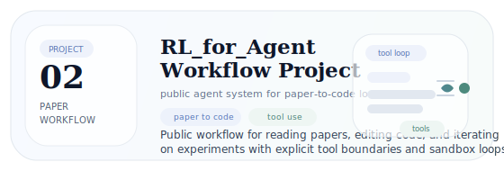
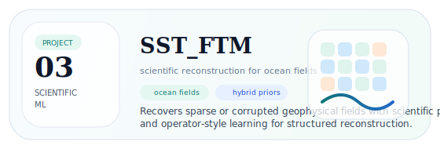
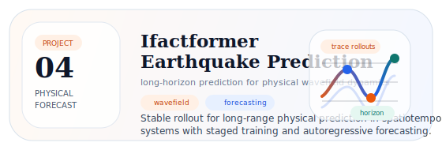

  

<h1 align="center">lkun</h1>

  <strong>Research engineer building AI agents for scientific ML.</strong>

  <strong>AI for Science</strong> · Artificial Intelligence undergraduate at South China Agricultural University

  I build AI-for-Science systems across both workflow and modeling: agent infrastructure for scientific tasks, public paper-to-code experimentation systems, and scientific ML projects for reconstruction and forecasting in physical domains.

  <a href="mailto:lkun45598@gmail.com">lkun45598@gmail.com</a> ·
  <a href="https://github.com/lkun45598-lgtm">GitHub</a> ·
  <a href="https://github.com/lkun45598-lgtm/RL_for_Agent">RL_for_Agent</a> ·
  <a href="https://github.com/lkun45598-lgtm/SST_FTM">SST_FTM</a> ·
  <a href="https://github.com/lkun45598-lgtm/Ifactformer-Earthquake-Prediction">Ifactformer-Earthquake-Prediction</a>

---

## About

I am an undergraduate in Artificial Intelligence building AI-for-Science systems from infrastructure to modeling.

My work spans several adjacent directions in AI for Science, including agent systems, scientific workflows, reconstruction, and forecasting.

These projects are not one single pipeline. They are independent but representative pieces of how I approach research engineering and scientific ML.

---

## GitHub Pulse

<!-- stats:start -->
<table>
  <tr>
    <td align="center"><strong>11</strong> Public Repos</td>
    <td align="center"><strong>55</strong> Total Stars</td>
    <td align="center"><strong>5</strong> Followers</td>
    <td align="center"><strong>267</strong> Contributions (1y)</td>
  </tr>
  <tr>
    <td align="center"><strong>191</strong> Commits (1y)</td>
    <td align="center"><strong>30</strong> Active Days (1y)</td>
    <td align="center"><strong>1</strong> Current Streak</td>
    <td align="center"><strong>7</strong> Best Streak</td>
  </tr>
</table>

  Most-starred public repo: <a href="https://github.com/lkun45598-lgtm/SST_Data_Imputation">SST_Data_Imputation</a> (8 stars) · Updated 2026-03-28 09:54 UTC. This section is refreshed automatically with GitHub Actions.

<!-- stats:end -->

---

## Selected Projects

Four projects that represent different parts of my current work in AI for Science.

<table>
  <tr>
    <td width="50%" valign="top">
      

        
      

      

        <strong>Private Ocean Agent Infrastructure</strong> 
        Private agent service for ocean preprocessing, orchestration, and controlled scientific execution.
      

    </td>
    <td width="50%" valign="top">
      

        
      

      

        <a href="https://github.com/lkun45598-lgtm/RL_for_Agent"><strong>RL_for_Agent</strong></a> 
        Public workflow system for reading papers, editing code, and iterating on experiments.
      

    </td>
  </tr>
  <tr>
    <td width="50%" valign="top">
      

        
      

      

        <a href="https://github.com/lkun45598-lgtm/SST_FTM"><strong>SST_FTM</strong></a> 
        Scientific ML for field reconstruction with ocean priors and operator-style modeling.
      

    </td>
    <td width="50%" valign="top">
      

        
      

      

        <a href="https://github.com/lkun45598-lgtm/Ifactformer-Earthquake-Prediction"><strong>Ifactformer-Earthquake-Prediction</strong></a> 
        Long-horizon wavefield forecasting with staged training and autoregressive rollout.
      

    </td>
  </tr>
</table>

  These are independent projects rather than one fixed pipeline.

---

## Focus

- Scientific agent infrastructure with controlled tools, SSE services, and experiment automation
- Reconstruction models for ocean and geophysical fields under sparse or corrupted observations
- Forecasting models for long-horizon physical dynamics and spatiotemporal systems

---

## Open Repositories

| Repository | Why start here |
| --- | --- |
| [RL_for_Agent](https://github.com/lkun45598-lgtm/RL_for_Agent) | The clearest public entry into my agent engineering: paper reading, code editing, tool use, and experimental iteration. |
| [SST_FTM](https://github.com/lkun45598-lgtm/SST_FTM) | A reconstruction-focused scientific ML repository for SST fields, combining priors with operator-style learning. |
| [Ifactformer-Earthquake-Prediction](https://github.com/lkun45598-lgtm/Ifactformer-Earthquake-Prediction) | A forecasting-focused repository for long-horizon seismic wavefield prediction and rollout stability. |
| [The-homework-of-Numerical-Analysis](https://github.com/lkun45598-lgtm/The-homework-of-Numerical-Analysis) | The mathematical base behind how I think about approximation, stability, discretization, and physical modeling. |

---

## Contact

- Email: [lkun45598@gmail.com](mailto:lkun45598@gmail.com)
- GitHub: [lkun45598-lgtm](https://github.com/lkun45598-lgtm)
- Affiliation: South China Agricultural University
- Open to research and engineering collaboration.

Earlier Projects

 

| Repository | Note |
| --- | --- |
| [High-Speed-Rail-Ticket-Booking-Management-System.](https://github.com/lkun45598-lgtm/High-Speed-Rail-Ticket-Booking-Management-System.) | C systems practice with linked lists, persistence, and order management. |
| [PUBG-Weapon-Sound-Recognition-and-Inventory-System.](https://github.com/lkun45598-lgtm/PUBG-Weapon-Sound-Recognition-and-Inventory-System.) | Application-style ML project combining GUI, audio processing, and model training. |
| [SST_Data_Imputation](https://github.com/lkun45598-lgtm/SST_Data_Imputation) | Earlier SST reconstruction work. |
| [SST_Data_Imputation_2.0](https://github.com/lkun45598-lgtm/SST_Data_Imputation_2.0) | A follow-up iteration on SST reconstruction and modeling. |

