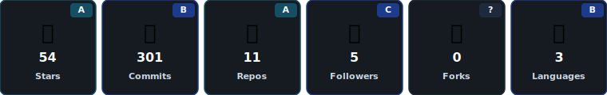
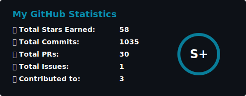
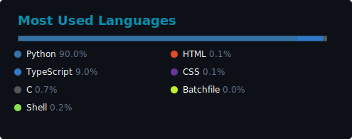
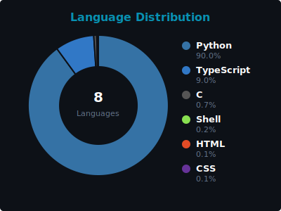
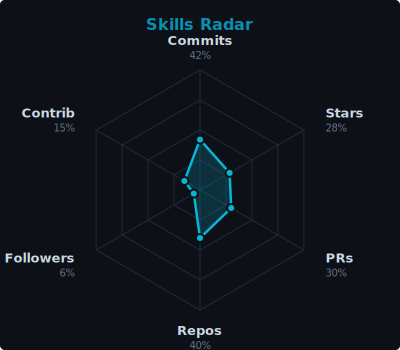
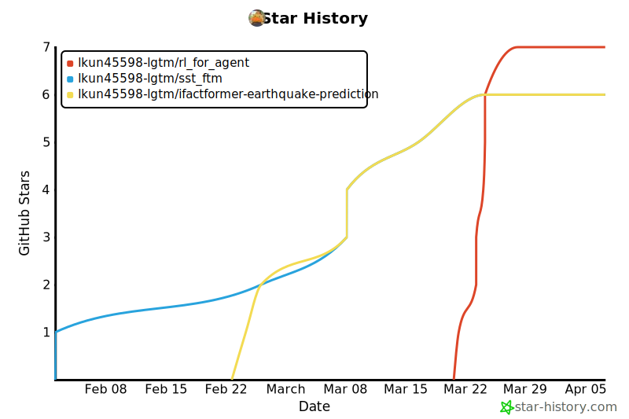

<!--   status badges -->
<p align="center">
    <a href="https://github.com/lkun45598-lgtm/lkun45598-lgtm"></a>
    <a href="https://www.python.org/"></a>
    <a href="https://github.com/lkun45598-lgtm?tab=repositories"></a>
    <a href="https://github.com/lkun45598-lgtm?tab=followers"></a>
</p>

<!--   typing SVG -->
<p align="center">
  <a href="https://git.io/typing-svg"></a>
</p>

<!--   contact icons -->
<p align="center">
  <a href="mailto:lkun45598@gmail.com"></a>&nbsp;
  <a href="https://github.com/lkun45598-lgtm"></a>&nbsp;
  <a href="https://www.scau.edu.cn"></a>
</p>

<!--   navigation -->
<p align="center">
  <a href="#about"></a>
  <a href="#tech-stack"></a>
  <a href="#projects"></a>
  <a href="#github-stats"></a>
  <a href="#contact"></a>
</p>

---

## About

- **AI undergraduate** at South China Agricultural University, focused on **Agent + scientific research automation** for ocean science
- Building end-to-end agent services that orchestrate scientific workflows — from satellite data ingestion to model training
- Current work: SST / Chl-a imputation from sparse satellite observations, ocean field super-resolution, automated loss transfer from papers to training pipelines

---

## Currently Working On

- **Loss Transfer System** — auto-extracting loss functions from research papers and migrating them into active training runs with 4-stage validation
- **Chl-a Multi-source Fusion** — 152-channel input (SST + Chl-a + masks + coordinate encoding + physical feature engineering) for chlorophyll-a imputation
- **Ocean Agent Service** — production SSE streaming API with 8 tool sets for end-to-end scientific ML orchestration

---

## Tech Stack

| Property                                  | Data                                                                                                                                                                                                                                                     |
|-------------------------------------------|----------------------------------------------------------------------------------------------------------------------------------------------------------------------------------------------------------------------------------------------------------|
| **Language / Framework**                  |       |
| **Scientific ML**                         |       |
| **Agent / Infra**                         |      |
| **Ocean Data**                            |        |
| **Tools / CI**                            |       |

<!--   research architecture -->

<div align="center">
<h3>🌊 AI for Ocean Science</h3>
</div>

<table>
<tr>
<th align="center" width="33%">🤖 Agent Infra</th>
<th align="center" width="33%">🧠 Scientific ML</th>
<th align="center" width="33%">📡 Data Pipeline</th>
</tr>
<tr>
<td align="center" valign="top">

<a href="https://github.com/lkun45598-lgtm/RL_for_Agent"></a>
<br>


<br>

```
Paper → Loss Formula
→ Code Injection
→ 4-Stage Validation
→ Training Run
```

</td>
<td align="center" valign="top">

<a href="https://github.com/lkun45598-lgtm/SST_FTM"></a>
<br>
<a href="https://github.com/lkun45598-lgtm/Ifactformer-Earthquake-Prediction"></a>


<br>

```
Sparse Obs
→ Physical Prior + Neural Op
→ Reconstruction
→ Forecasting
```

</td>
<td align="center" valign="top">


<br>


<br>

```
Satellite / Reanalysis
→ NetCDF → NPY
→ Validation
→ Training Pipeline
```

</td>
</tr>
</table>

---

## Projects

<div align="center">

[](https://github.com/lkun45598-lgtm)
[](https://github.com/lkun45598-lgtm/RL_for_Agent)
[](https://github.com/lkun45598-lgtm/SST_FTM)
[](https://github.com/lkun45598-lgtm/Ifactformer-Earthquake-Prediction)

</div>

<br>

<details>
<summary><b>Ocean Agent Infrastructure — Scientific Research Automation Service</b></summary>
<br>


A production Agent HTTP service for ocean science research automation, built on KODE SDK. Provides an SSE streaming API that orchestrates the full scientific workflow — from raw satellite data ingestion to model training and experiment iteration — as a single controllable service.

| Component | Description |
|:---|:---|
| Agent Service | SSE streaming API · multi-model support (Claude / OpenAI-compat / Gemini) · session persistence |
| 8 Tool Sets | General filesystem · ocean SR preprocessing · SR training management · SST time-series preprocessing · time-series training |
| Data Validation | 3-layer declarative validation: shape contracts · land mask invariance · manifest audit |
| Training Management | Spawns and monitors 8-GPU DDP jobs for SwinIR / EDSR / FNO2d / UNet2d |
| Loss Transfer | Auto-extracts loss functions from research papers · 4-layer validation (static → smoke → single-epoch → full) |

- **Stack**: Node.js · TypeScript · KODE SDK · SSE · Python · 8-GPU DDP

</details>

<details>
<summary><b>RL_for_Agent — Loss Transfer & Experiment Automation</b></summary>
<br>


Public interface to the ocean research automation system. The core contribution is a **Loss Transfer pipeline** that reads a research paper, extracts the loss formulation, and automatically migrates it into the active training codebase with multi-stage validation.

| Component | Description |
|:---|:---|
| Loss Transfer | Paper → `loss_formula.json` → code injection → 4-stage validation → training run |
| Ocean SR Experiments | SwinIR / EDSR / FNO2d / UNet2d on 4× ocean field super-resolution |
| Best Result | SwinIR val\_ssim **0.6645** · multi-scale relative L2 + gradient + residual FFT loss |
| Experiment Log | 50+ tracked experiments (`sandbox/results.tsv`) |

- **Stack**: Node.js · TypeScript · KODE SDK · Python · PyTorch
- **[View Repository →](https://github.com/lkun45598-lgtm/RL_for_Agent)**

</details>

<details>
<summary><b>SST_FTM — Sea Surface Temperature Reconstruction with Physical Priors</b></summary>
<br>


Physics-informed deep learning framework for SST reconstruction from cloud-contaminated satellite observations. Combines a Functional Tucker Model (FTM) for physical low-rank structure with an FNO-CBAM residual network for high-frequency detail.

| Component | Description |
|:---|:---|
| FTM Prior | Tucker decomposition + SIREN coordinate networks; learns low-rank ocean basis functions from complete OSTIA data |
| FNO-CBAM Residual | Fourier Neural Operator + channel/spatial attention; reconstructs high-frequency details on top of FTM prior |
| Two-stage Training | Stage 1: pretrain FTM on OSTIA (full coverage, 30 epochs) · Stage 2: fine-tune on JAXA L3 sparse observations (100 epochs) |
| Results | RMSE **~0.5 K** · MAE **~0.35 K** on JAXA L3 test set |

- **Data**: JAXA Himawari L3 (2015–2024, 9 years, 451×351) · OSTIA global SST
- **Stack**: Python · PyTorch · FNO · SIREN · 8-GPU DDP
- **[View Repository →](https://github.com/lkun45598-lgtm/SST_FTM)**

</details>

<details>
<summary><b>Ifactformer-Earthquake-Prediction — Seismic Wavefield Forecasting</b></summary>
<br>


Adaptation of the IFactFormer factorized Transformer architecture for long-horizon seismic wavefield prediction. Built a custom training pipeline, mmap-based dataset loader, and evaluation suite on top of the original architecture, applied to the WaveCastNet seismic dataset.

| Component | Description |
|:---|:---|
| Architecture | IFactFormer — factorized attention across spatial and temporal dimensions |
| Data | WaveCastNet · **149 GB** · 30 trajectories · 3-channel physical field · 376×256 spatial grid |
| Prediction | **460-step** autoregressive rollout from a single input frame |
| Training | 8-GPU DDP · mmap lazy-loading to handle 149 GB without full RAM load |

- **Stack**: Python · PyTorch · Factorized Transformer · 8-GPU DDP
- **[View Repository →](https://github.com/lkun45598-lgtm/Ifactformer-Earthquake-Prediction)**

</details>

<details>
<summary>Other repositories</summary>

<br>

| Repository | Description |
|:---|:---|
| [The-homework-of-Numerical-Analysis](https://github.com/lkun45598-lgtm/The-homework-of-Numerical-Analysis) | Mathematical foundations: approximation, stability, discretization, physical modeling. |
| [SST_Data_Imputation](https://github.com/lkun45598-lgtm/SST_Data_Imputation) | Earlier SST reconstruction work. |
| [SST_Data_Imputation_2.0](https://github.com/lkun45598-lgtm/SST_Data_Imputation_2.0) | Follow-up iteration on SST reconstruction. |
| [High-Speed-Rail-Ticket-Booking-Management-System.](https://github.com/lkun45598-lgtm/High-Speed-Rail-Ticket-Booking-Management-System.) | C systems practice with linked lists, persistence, and order management. |
| [PUBG-Weapon-Sound-Recognition-and-Inventory-System.](https://github.com/lkun45598-lgtm/PUBG-Weapon-Sound-Recognition-and-Inventory-System.) | ML project combining GUI, audio processing, and model training. |

</details>

---

## GitHub Stats

### GitHub Profile Trophy

<div align="center">



</div>

### GitHub Activity Graph


<div align="center">
<table>
  <tr>
    <td width="50%" align="center">
      
    </td>
    <td width="50%" align="center">
      
    </td>
  </tr>
</table>
</div>

<div align="center">
<table>
  <tr>
    <td width="50%" align="center">
      
    </td>
    <td width="50%" align="center">
      
    </td>
  </tr>
</table>
</div>

<div align="center">


</div>

<div align="center">


</div>



---

## Star History

<div align="center">

[](https://star-history.com/#lkun45598-lgtm/RL_for_Agent&lkun45598-lgtm/SST_FTM&lkun45598-lgtm/Ifactformer-Earthquake-Prediction&Date)

</div>

---

## Contact

<p align="center">
  <a href="mailto:lkun45598@gmail.com"></a>&nbsp;
  <a href="https://github.com/lkun45598-lgtm"></a>
</p>

<p align="center">
  Open to research collaboration in AI for ocean science and scientific research automation.
</p>

---

<p align="center">
  <a href="https://info.flagcounter.com/"></a>
</p>

---

<div align="center">

### Thanks for visiting! ❤️


*If you liked my profile, you can Star ⭐ the repo!*

</div>


