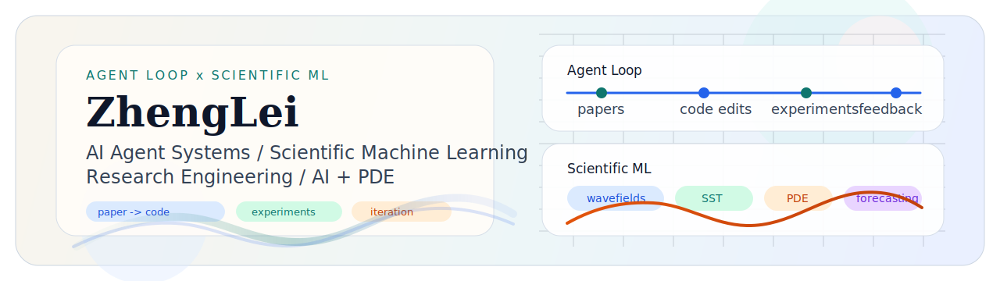

  

<h1 align="center">lkun</h1>

  <strong>Research engineer building AI agents for scientific ML.</strong>

  <strong>AI for Science</strong> · Artificial Intelligence undergraduate at South China Agricultural University

  I work on tool-using agents for code and experiment automation, and on scientific ML for reconstruction and long-horizon forecasting in physical systems.

  <a href="mailto:lkun45598@gmail.com">lkun45598@gmail.com</a> ·
  <a href="https://github.com/lkun45598-lgtm">GitHub</a> ·
  <a href="https://github.com/lkun45598-lgtm/RL_for_Agent">RL_for_Agent</a> ·
  <a href="https://github.com/lkun45598-lgtm/SST_FTM">SST_FTM</a> ·
  <a href="https://github.com/lkun45598-lgtm/Ifactformer-Earthquake-Prediction">Ifactformer-Earthquake-Prediction</a>

---

## About

I am an undergraduate in Artificial Intelligence working on AI agents for code and experiment automation, and on scientific ML for reconstruction and long-horizon forecasting.

What I care about most is turning papers into reproducible systems: something that can be read, implemented, tested, and improved through real experimental loops.

---

## GitHub Pulse

<!-- stats:start -->
<table>
  <tr>
    <td align="center"><strong>12</strong> Public Repos</td>
    <td align="center"><strong>41</strong> Total Stars</td>
    <td align="center"><strong>18</strong> Followers</td>
    <td align="center"><strong>286</strong> Contributions (1y)</td>
    <td align="center"><strong>214</strong> Commits (1y)</td>
  </tr>
</table>

  Updated demo mode. This section is refreshed automatically with GitHub Actions.

<!-- stats:end -->

---

## Featured Work

The projects below are the clearest entry points into how I work.

<table>
  <tr>
    <td>
      <strong><a href="https://github.com/lkun45598-lgtm/RL_for_Agent">RL_for_Agent</a></strong> · Agent Systems 
      Agent framework for paper reading, code editing, sandbox execution, and iterative experimentation. 
      Built around explicit tool boundaries, REST and SSE services, and paper-to-code workflows.
    </td>
  </tr>
</table>

<table>
  <tr>
    <td>
      <strong><a href="https://github.com/lkun45598-lgtm/SST_FTM">SST_FTM</a></strong> · Scientific ML 
      Structured SST reconstruction that combines FTM priors, FNO residual learning, and attention-based refinement. 
      Represents my work on scientific ML for spatiotemporal and geophysical data.
    </td>
  </tr>
</table>

<table>
  <tr>
    <td>
      <strong><a href="https://github.com/lkun45598-lgtm/Ifactformer-Earthquake-Prediction">Ifactformer-Earthquake-Prediction</a></strong> · Wavefield Forecasting 
      Long-horizon seismic wavefield forecasting with staged training and multi-step autoregressive rollout. 
      Focused on stability and long-range prediction in physical field modeling.
    </td>
  </tr>
</table>

---

## Focus

- AI agents for code editing, tool use, and experiment automation
- Scientific ML for reconstruction, forecasting, and physical field modeling
- Reproducible research systems from mathematical foundations to implementation

---

## Selected Repositories

| Repository | Why it matters |
| --- | --- |
| [RL_for_Agent](https://github.com/lkun45598-lgtm/RL_for_Agent) | My main agent systems project for tool use, code modification, planning, and experimental iteration. |
| [SST_FTM](https://github.com/lkun45598-lgtm/SST_FTM) | A hybrid scientific ML project for SST reconstruction that combines priors, operator learning, and attention. |
| [Ifactformer-Earthquake-Prediction](https://github.com/lkun45598-lgtm/Ifactformer-Earthquake-Prediction) | A wavefield forecasting project centered on long-horizon prediction and autoregressive stability. |
| [The-homework-of-Numerical-Analysis](https://github.com/lkun45598-lgtm/The-homework-of-Numerical-Analysis) | The mathematical foundation behind how I think about approximation, stability, and PDE-related modeling. |

---

## Contact

- Email: [lkun45598@gmail.com](mailto:lkun45598@gmail.com)
- GitHub: [lkun45598-lgtm](https://github.com/lkun45598-lgtm)
- Affiliation: South China Agricultural University
- Open to research and engineering collaboration.

Earlier Projects

 

| Repository | Note |
| --- | --- |
| [High-Speed-Rail-Ticket-Booking-Management-System.](https://github.com/lkun45598-lgtm/High-Speed-Rail-Ticket-Booking-Management-System.) | C systems practice with linked lists, persistence, and order management. |
| [PUBG-Weapon-Sound-Recognition-and-Inventory-System.](https://github.com/lkun45598-lgtm/PUBG-Weapon-Sound-Recognition-and-Inventory-System.) | Application-style ML project combining GUI, audio processing, and model training. |
| [SST_Data_Imputation](https://github.com/lkun45598-lgtm/SST_Data_Imputation) | Earlier SST reconstruction work. |
| [SST_Data_Imputation_2.0](https://github.com/lkun45598-lgtm/SST_Data_Imputation_2.0) | A follow-up iteration on SST reconstruction and modeling. |

